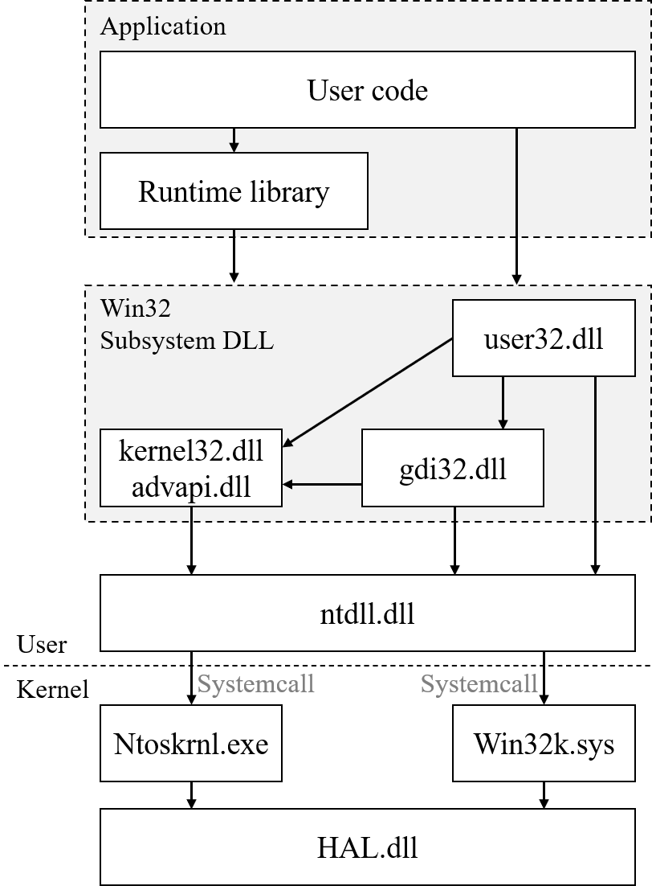

# C# Samples

This repository contains:

#

## Samples

- [WPF] `KeyHookingApp` use RegisterHotKey(user32.dll) HotKeyManager.cs
- [WPF] `RampApp` use SetGammaRamp(gdi32.dll) RampDisplay.cs

#

## Background

ntdll, user32, gdi32에 대한 그림

